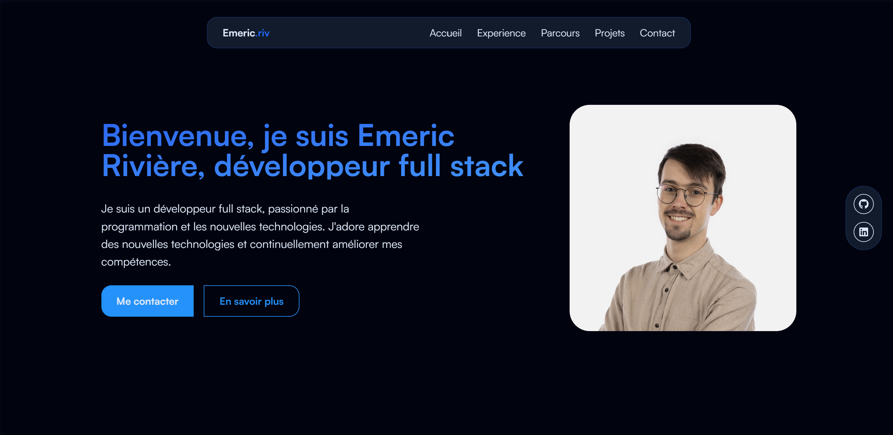

# Portfolio - Emeric Rivière

Bienvenue sur le dépôt de mon portfolio personnel. Ce projet met en avant mon parcours, mes compétences et mes projets réalisés.

## 🚀 Technologies utilisées

- **React** - Bibliothèque JavaScript pour la création d'interfaces dynamiques.
- **TypeScript** - Superset de JavaScript pour une meilleure gestion des types.
- **Vite** - Outil de build rapide pour les projets React.
- **Tailwind CSS** - Framework CSS pour un design moderne et réactif.

## 📸 Aperçu du projet



## 🔗 Accès au site

Le portfolio est disponible à l'adresse suivante :
[https://emeric-riviere.com](https://emeric-riviere.com)

## 📜 Fonctionnalités

- Présentation de mon parcours et de mes compétences.
- Affichage interactif de mes projets avec des aperçus.
- Navigation fluide avec une interface moderne.
- Responsive design pour une compatibilité avec tous les écrans.

## 🛠 Installation et exécution

Pour exécuter ce projet en local :

1. **Cloner le dépôt**
   ```bash
   git clone https://github.com/Emeric-Riviere/portfolio.git
   cd portfolio
   ```
2. **Installer les dépendances**
   ```bash
   npm install
   ```
3. **Lancer l'application**
   ```bash
   npm run dev
   ```

L'application sera accessible à l'adresse `http://localhost:5173` par défaut.

## 🤝 Contribution

Les contributions sont les bienvenues ! Pour proposer des améliorations :

1. Fork le dépôt
2. Crée une branche (`feature/amélioration`)
3. Commit tes modifications (`git commit -m 'Ajout d'une amélioration'`)
4. Pousse ta branche (`git push origin feature/amélioration`)
5. Ouvre une Pull Request

## 📄 Licence

Ce projet est sous licence **MIT**. Tu es libre de le modifier et de le partager avec attribution.

---

Merci d'avoir visité mon portfolio ! 😊 N'hésite pas à me contacter si tu as des questions ou des suggestions.
